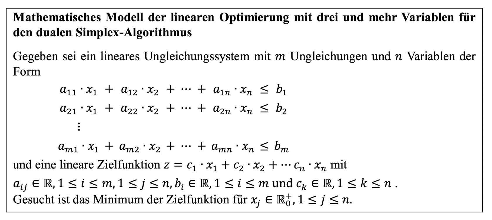
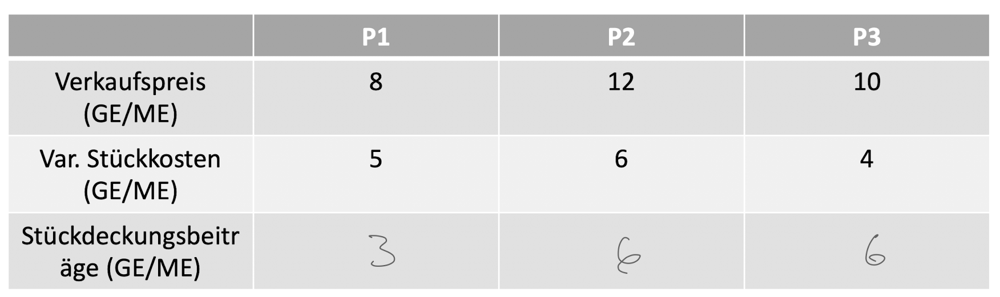
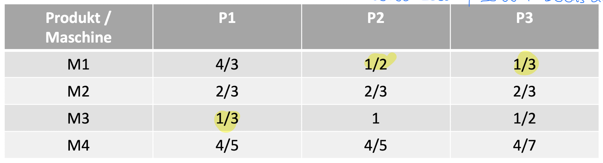
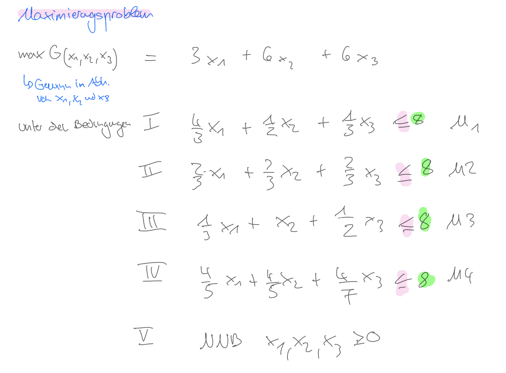
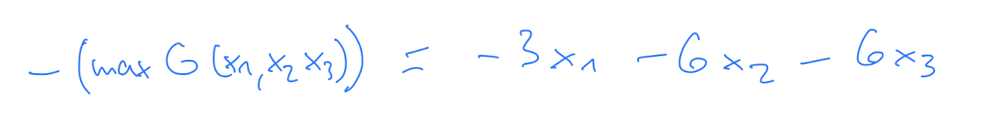
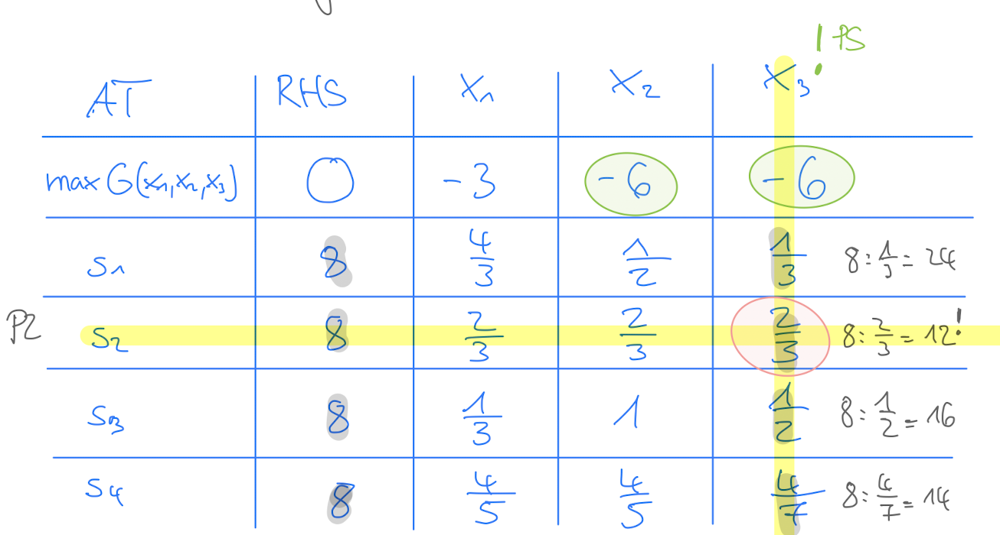
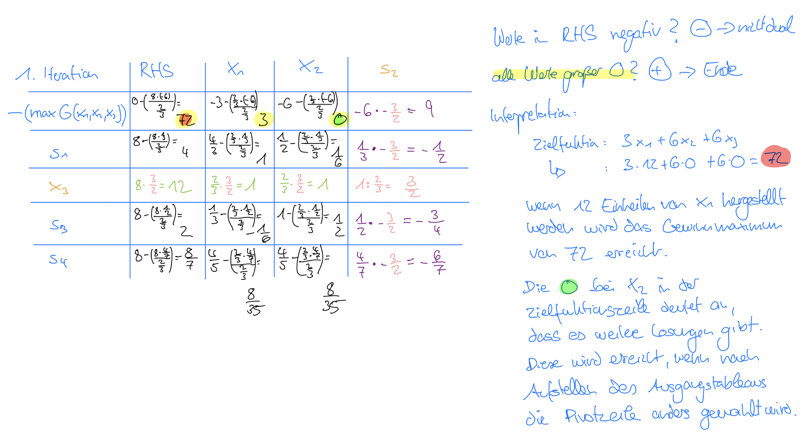

# Dualer Simplex-Algorithmus

## Ausgangsbasis beim primalen/dualen Simplex-Algorithmus:
- Zielfunktion muss linear sein ($y=m*x+c$)
- Nebenbedingungen müssen ebenfalls linear sein ($y=m*x+c$)
- es dürfen keine linearer Abhängigkeit der Spalten bestehen
- es dürfen keine linearen Abhängigkeit der Zeilen bestehen
- der Lösunsgraum darf nicht leer sein
- der Lösungsraum darf nicht beschränkt sein

## Definitionen:
- $x_i$ = Nichtbasisvariablen / Strukturvariablen
- $s_i$ = Basisvariablen / Schlupfvariablen
- aus wirtschaftlicher Sicht müssen alle Nichtbasisvariablen $\geq$ 0 sein (sog. Nichtnegativitätsbedingung)
- Simplex-Algorithmus: iteratives Berechnen der Eckpunkte des Lösungsraums --> so nähert sich der Wert der Zielfunktion iterativ dem Minimum/Optimum an

## Anwendbarkeit des dualen Simplex-Algorithmus:
- alle Bedingungen/Ungleichungen sind in der Form $\leq$ (kleiner gleich), falls nein muss diese Ungleichung mit -1 multipliziert werden
- alle Werte der Right Hand Side (außer in der Zielfunktion) sind $\geq 0$ --> sonst dualer Simplex-Algorithmus
- Zielfunktion in Minimalform?

    Hintergrund: Der Simpelx-Algorithmus sucht immer das Minimum einer Funktion, d.h.
    - Minimierungsproblem, nichts tun
    - Maximierungsproblem, Zielfunktion mit -1 multiplizieren

1. **Aufstellen des ersten Simplex-Tableaus**
    
    

    1. **Aufstellen der Restriktionen** (aus Tabelle oder Text, beachte dabei die Form der Restriktionen)
    
    - alle Bedingungen sind $\leq$ --> nichts tun --> primaler Simplex-Algorithmus
    - alle Bedingungen sind $\geq$ --> Restriktion mit -1 multiplizieren --> vermutlich dualer Simplex-Algorithmus (solange mind. ein negativer Wert in RHS vorhanden)

    2. **Aufstellen der Nichtnegativitätsbedingung**
    - alle Nichtbasisvariablen $x_1, x_2, x_3, ... \geq$ 0

    3. **Aufstellen der Zielfunktion** (aus Text)
    

    4. **Maximierungsproblem vs. Minimierungsproblem?**
    - Liegt ein Minimierungsproblem vor? (z.B. Gesamtkosten sollen möglichst klein sein) --> Zielfunktion bleibt wie sie ist
    - Liegt ein Maximierungsproblem vor? (z.B. Gewinn soll möglichst groß sein) --> Zielfunktion wird mit -1 multipliziert
        
        
        
        Warum? Der Simpelx-Algorithmus sucht immer das Minimum einer Funktion.

        - -f(x) = -1 * f(x)
        - wenn f(x) ein Maximierungsproblem ist, dann ist -f(x) ein Minimierungsproblem
        - Hochpunkte von f(x) sind Tiefpunkte von -f(x)
        - aber die Extremwerte bleiben gleich
    
            
    
    5. **Ungleichungssystem in lineares Gleichungssystem überführen**
    - Einfügen der Schlupfvariablen $(s_1, s_2, s_3, ...)$
    
  
    - Umstellen der Ungleichungen nach den Schlupfvariablen
        

    6. **Übertragen in ein Tableau**
        - Bedingungen: bei Übernahme nicht mehr mit -1 multiplizieren
        - Zielfunktion: bei Übernahme nicht mehr mit -1 multiplizieren
        - in Spalte "RHS" und Zeile "Zielfunktion" 0 eintragen

            

**Schritt 1:**

### Fall 1: Es gibt noch mindestens einen negativen Eintrag in der RHS-Spalte
- alle Werte in der RHS $\geq$ 0? (solange durchführen bis alle Einträge in der RHS-Spalte positiv sind)
    - wenn **Ja**, dann **zulässige Lösung** gefunden, ggfs. weiter mit primalem Simplex-Algorithmus, um zur **optimalen Lösung** zu gelangen
    - wenn **Nein**, dann Zeile Pivotzeile = Zeile mit kleinstem Koeffizienten in der RHS-Spalte
    
        (wenn es mehrere Zeilen mit gleichem minimalen Koeffizienten gibt, dann willkürlich eine davon auswählen)

2. **Pivotzeile festlegen:** 
- Zeile mit kleinstem Wert in RHS suchen

3. **Pivotspalte bestimmen:** 
- bei Maximum aus Zielfunktion und dem entsprechenden Koeffizienten in der Pivotzeile bilden:

    $max(\frac{Zielfunktion}{PZ})$ mit PZ $\lt$ 0

    Voraussetzung: Koeffizient in Pivotzeile $\lt$ 0 --> sonst keine zulässige Lösung möglich, d.h. Lösungsmenge des Ungleichungssystem ist leer.
    
    "teile nur durch negative Zahlen in PZ"

4. **Pivotelement**: PS x PZ

### Fall 2: Alle Einträge in der RHS-Spalte sind positiv (Übergang zum primalen Simplex-Algorithmus)

2. **Pivotspalte festlegen:** 
- alle Werte in der Zielfunktion $\geq$ 0?
    - wenn **Ja**, dann **optimale Lösung** gefunden, es sei denn es gibt nach der letzten (primalen) Iteration noch Koeffizienten von $x_i = 0$, dann gibt es weitere Lösungen
    - wenn **Nein**, dann Spalte Pivotspalte = Spalte mit kleinstem Koeffizienten in der Zielfunktion

        (wenn es mehrere Spalten mit gleichem minimalen Koeffizienten gibt, dann willkürlich eine davon auswählen)

3. **Pivotzeile bestimmen:** 
- bei Minimum aus Right Hand Side (RHS) der Bedingungen und dem entsprechenden Koeffizienten in der Pivotspalte:

    $min(\frac{RHS}{PS})$ mit PS $\gt$ 0

    Voraussetzung: Koeffizient in Pivotspalte $\gt$ 0
    "teile nur durch positive Zahlen in PS"
    
4. **Pivotelement**: PS x PZ

**Schritt 2:**

5. **Variablen tauschen:**
- Nichtbasisvariable $(x_i)$ aus PS und Basisvariable $(s_i)$ aus PZ tauschen

6. **Pivotelement:** 
Pivotelement durch seinen Kehrwert ersetzen
$neuesPivotelement = \frac{1}{altesPivotelement}$

7. **Pivotzeile:** 
Alle restlichen Elemente der Pivotzeile werden mit dem Kehrwert des alten Pivotelements multipliziert.

    $neuesElementPivotzeile = altesElementPivotzeile * \frac{1}{altesPivotelement}$

8. **Pivotspalte:** 
Alle restlichen Elemente der Pivotspalte werden mit dem dem negativen Kehrwert des alten Pivotelements multipliziert

    $neuesElementPivotspalte = altesElementPivotspalte * \frac{-1}{altesPivotelement}$

9. **Restliche Werte**
Alle anderen Werte werden spaltenweise ersetzt nach folgender Formel:

    $neuerWert = alterWert - (\frac{alteZeile*alteSpalte}{altesPivotelement})$

**Weitere Iteration?:**
- sind alle Einträge in der RHS positiv?
    - wenn **Ja** so ist eine **zulässige Lösung** erreicht. Dann Übergang zu primalem Simplex-Algorithmus, um **optimale Lösung** zu finden.
    - wenn **Nein**, dann weitere Iteration mit Schritt 1 möglich bis alle Werte in der RHS positiv sind
- alle Werte in der Zielfunktionszeile $\geq$ 0?
    - wenn **Ja**, dann optimale Lösung gefunden, es sei denn es gibt nach der letzten Iteration noch Koeffizienten von $x_i = 0$, dann gibt es weitere Lösungen
    - wenn **Nein**, dann weitere Iteration mit Schritt 1

        